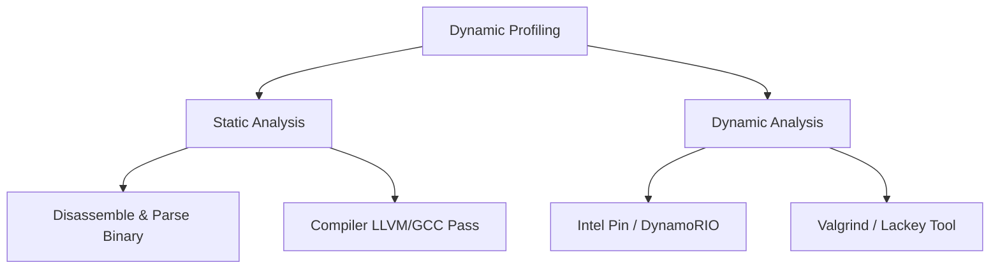

# SPEC CPU 2017 Benchmarking Assignment

Welcome to the SPEC CPU 2017 Benchmarking project repository. This guide provides comprehensive setup instructions, compilation workflows, plotting requirements, and tools for analyzing compiler optimizations and basic block statistics.

---

## 🚀 Getting Started

### 1. Installation of SPEC CPU 2017
The SPEC CPU 2017 ISO image is pre-mounted in your home directory on the lab machine.
1. Follow the official installation guide: [SPEC CPU 2017 Unix Installation Guide](https://www.spec.org/cpu2017/Docs/install-guide-unix.html).
2. Run the installation script:
   ```bash
   ./install.sh
   ```
3. Set up the environment variables:
   ```bash
   source shrc
   ```

### 2. Overview of the Benchmark Suite
Familiarize yourself with the benchmark structures by reading the [SPEC CPU 2017 Overview](https://www.spec.org/cpu2017/Docs/overview.html).
* Focus on the **SPEC-RATE Integer Benchmarks**.
* You may skip the Fortran benchmark: `548.exchange2_r`.

---

## 🛠️ Compiler & Optimization Matrix

You need to compile the benchmarks across multiple compiler suites, target bitnesses, and optimization levels:

| Compiler | Bitness | Optimization Levels | Notes / Configs |
| :--- | :--- | :--- | :--- |
| **GCC** | 32-bit & 64-bit | `-O0`, `-O1`, `-O2`, `-O3` | Standard setup |
| **Clang** | 32-bit & 64-bit | `-O0`, `-O1`, `-O2`, `-O3` | Standard setup |
| **ICC (icx)** | 32-bit & 64-bit | `-O0`, `-O1`, `-O2`, `-O3` | Use modern standards flags |

> [!TIP]
> Since the benchmarks are older and `icx` expects modern standard compliance, default flags may fail. Check working configurations online at [SPEC Results Q1 2025](https://spec.cs.miami.edu/cpu2017/results/res2025q1/) for flag adjustments (e.g., `-std=c99` or `-fcommon` equivalents).

---

## 📊 Plotting Runtimes & Scores

You must produce a total of **9 graphs** (one for each individual integer benchmark).
* **X-Axis:** Optimization Levels (`-O0`, `-O1`, `-O2`, `-O3`)
* **Y-Axis:** Execution Time (seconds) or SPEC Score
* **Plot Lines:** Each graph should contain curves for:
  - GCC (32-bit)
  - GCC (64-bit)
  - Clang (32-bit)
  - Clang (64-bit)
  - ICC/icx (32-bit)
  - ICC/icx (64-bit)

### Running the Parsing & Plotting Pipeline

To automatically parse raw result files and generate all graphs:
```bash
# Parse raw benchmark CSVs into structured dataset
python3 scripts/parse_results.py

# Generate publication-quality benchmark plots in plots/
python3 scripts/plot_results.py
```

---

## 🔍 Addendum: Measuring Basic Block Instruction Counts

You are required to **measure the average number of instructions in a basic block** for each program/benchmark.

### What is a Basic Block?
A basic block is a straight-line code sequence with no branches in except at the entry and no branches out except at the exit.

### Recommended Approaches for Measurement:



1. **Valgrind (Lackey Tool):**
   Run the benchmark binary under the Lackey tool to count executed instructions and basic blocks dynamically:
   ```bash
   valgrind --tool=lackey --trace-mem=no --trace-superblocks=no ./benchmark_binary
   ```
   Lackey outputs the count of instructions (`I   refs`) and formatted jump/basic block execution patterns.

2. **Intel PIN / DynamoRIO:**
   Use a Pintool (specifically the basic block counting or instruction counting tool) to dynamically extract the block counts on x86 architectures.

3. **Compiler Passes (LLVM / Clang IR):**
   If you want static basic block size counts, write a custom LLVM analysis pass to iterate through every block in the Control Flow Graph (CFG) and compute:
   $$\text{Average Size} = \frac{\sum \text{Instructions in Block}}{\text{Total Blocks}}$$

---

## 📝 Turn-in Report Structure

Your report must be succinct, insightful, and address the following questions:

1. **Optimization Impact:** Which optimizations are the most and least consequential to runtime?
2. **Compiler Comparison:** Which compilers perform better in which aspects (compile time, binary size, runtime speed)?
3. **Bitness Comparison:** Which are faster: 32-bit or 64-bit executables? Why?
4. **Optimization Levels Strategy:** How do different optimization levels differ across GCC, Clang, and ICC?
5. **Benchmark Characteristics:** Does the kind of benchmark (memory-bound, compute-bound, branching-heavy) influence compiler optimization efficiency?
6. **Basic Block Profile:** How do the average basic block sizes relate to runtime performance and optimization scaling?

---

## 📂 Recommended Directory Structure

```text
SPEC-CPU2017-Benchmarking/
├── config/                 # SPEC CPU 2017 config files (.cfg)
├── scripts/                # Automating compilation, running, & parsing
│   ├── run_benchmarks.sh
│   └── parse_results.py
├── results/                # Raw log files and CSVs
│   ├── gcc_32.csv
│   └── icx_64.csv
├── basic_blocks/           # Basic block count analysis scripts/outputs
├── plots/                  # The 9 generated benchmark graphs
├── report.pdf              # Final Turn-in Report
└── README.md               # This project documentation
```